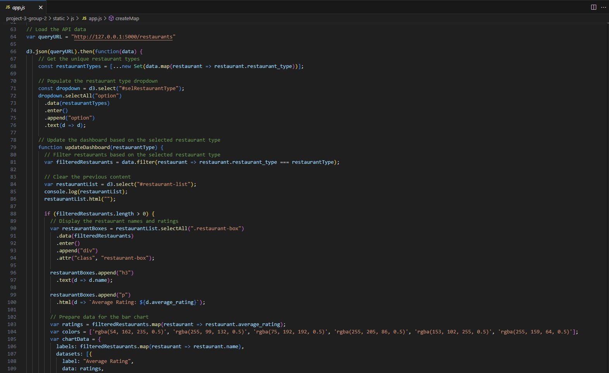
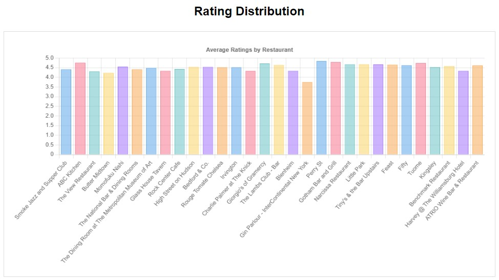
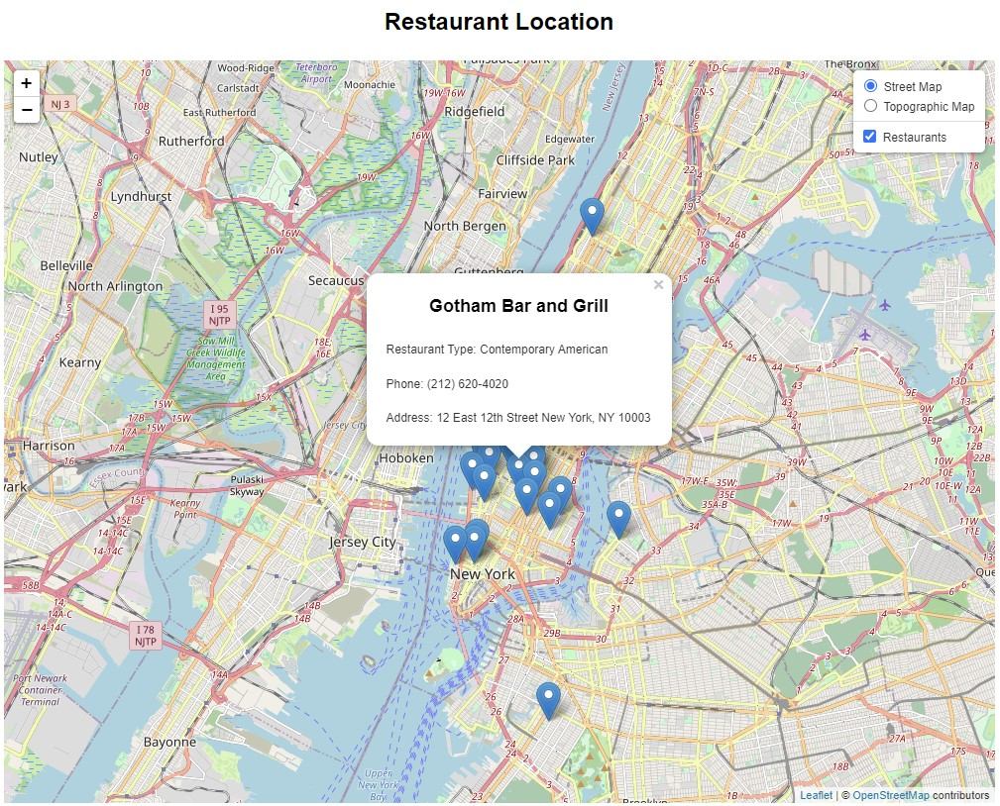

# PROJECT 3 GROUP 2

 

## NEW YORK CITY RESTAURANT RATINGS & REVIEWS

### Group 2 Members:
* Muntasir Billah
* Purnima Pathak
* David Jolia
* Matt Siriani
* Elizabeth Veltre

 

## ABOUT THE PROJECT

### Project Name
New York City Restaurant Ratings & Reviews

 

### Background
Rutgers University is organizing an educational tour to New York City for its diverse student body. To enhance their experience, Rutgers has enlisted the help of Team-2 Agency to analyze a NYC Restaurant dataset and provide visualizations that showcase the types of restaurants available in the city, along with their pricing and the cuisine they offer. The goal is to identify the best restaurants to visit during the students' stay and ensure they have a memorable culinary experience in NYC.

 

### Description
This project explores restaurant ratings, food reviews, and location-based information to provide insights into the vibrant culinary scene of New York City.

 

## TOOLS & LIBRARIES USED
* Postgres
* Flask
* Leaflet
* psychopg2
* D3
* flask_cors
* jsonify
* Charts.js

 

## CREATING THE RESTAURANT SITE

### CLEANING THE RAW DATA
1. Deleted unwanted columns and changed column headers
2. Saved as a CSV file

     

    ### Original Data

    

     

    ### Cleaned Data

    

 

### CREATING THE DATABASE
1. Created the restaurant database in Postgres
2. Imported the data from the CSV file
3. Added a numeric ID column as the Primary Key

     

    

 

### CREATING THE FLASK APP
1. Created a Flask app that read from the SQL database

     

    ### Flask Code

    
    
     

    ### Live API

    

 

### HTML, JS, & CSS
1. Built an HTML file for page structure, JavaScript for functionality, and CSS for styling

     
    
    ### HTML Code

    

     

    ### JavaScript Code

    

 

## VISUALIZATIONS

### RESTAURANT DASHBOARD

Restaurant Dashboard and Dropdown Menu
* The Restaurant List changes according to what is selected in the dropdown menu

     

    

 

### AVERAGE RATINGS

This chart shows average restaurant ratings based on selected restaurant type
* A user can make a quick decision where to eat by looking at the rating chart

     

    

 

### FOOD REVIEWS

This chart shows food reviews from customers based on the food they had
* By looking at this chart, a user can determine which restaurant has the best food

     

    

 

### RESTAURANT LOCATIONS

The Leaflet map shows each of the restaurants in New York City
* Clicking on a marker triggers a pop-up that displays the restaurant’s name, type of cuisine, phone number, and address

     

    

 

## DATASET & OTHER SOURCES

* Kaggle Data:  https://www.kaggle.com/datasets/popoandrew/restaurant-week-2018 
* Chart.js Documentation:  https://www.chartjs.org/docs/latest/ 

